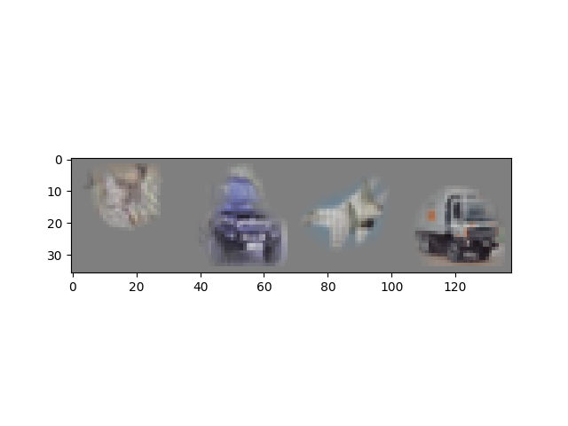
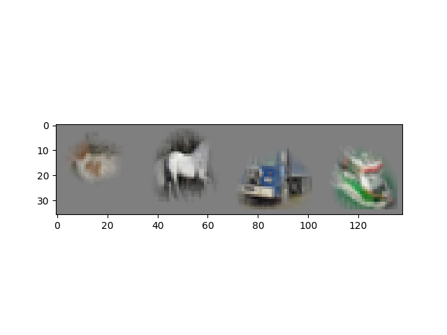

# SalienyMapper
Implementation of the paper :
Real Time Image Saliency for Black Box Classifiers
https://arxiv.org/abs/1705.07857

# Results

Example 1             |  Example 2
:-------------------------:|:-------------------------:
  |  
  |  
  |  
# Purpose
NIPS 2017 Paper Implementation Challenge . Even though the author's implementation exists, this is an attempt to make a more user friendly version of the code and especially purposed as a learning tool for the models in the paper.

Differences from the Official Implementation:

* Made for training on the Cifar10 dataset,  official repo  is meant to train the ImageNet Dataset
*  Less Verbose, only the core details present. Loss, Model and Trainer. Readable Code

# Files

* model.py ->  Main model hosted
* resnet.py -> Black Box Classifier
* train_classifier -> Trains classifier Model
* train_saliency -> Trains Saliency Model
# To do
- [ ] Logging
- [ ] Responsive Training bar ala Keras
- [ ] Validation Training
- [ ] Make code to work for any dataset
- [ ] Add circle ci and Docker support
- [ ] Command Line Interface
- [ ] ImageNet training

# Help
Referred to the author's repo ,this project was made on the shoulders of giants.
Official Repo: https://github.com/PiotrDabkowski/pytorch-saliency

